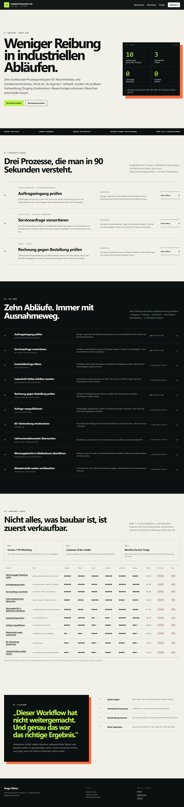

# Hugo Menz Industrial Automation Lab

[Public lab](https://hugomenz.github.io/automation-portfolio/) · [Opportunity matrix](docs/OPPORTUNITY_MATRIX.md) · [n8n proof layer](n8n/README.md) · [German content factory](content/linkedin/README.md)



Ten functional industrial workflow prototypes for machinery, service, procurement, quality and operations. The lab starts with a person losing time or capacity and ends with a concrete, inspectable improvement. Technology remains implementation infrastructure rather than the commercial promise.

## Truth status

- Every case is a **Synthetic Demo**.
- Workflow engines and fixtures are **Built and testable**.
- External ERP, CRM, QMS, DMS, CMMS and ticket integrations are **Mocked adapter**.
- None is customer validated, production deployed or backed by measured ROI.
- Every critical outcome requires a human decision and performs zero external writes.

## The ten workflows

| # | Problem | Buyer | Direct demo | Evidence |
|---:|---|---|---|---|
| 01 | Customer Order Intake | Vertriebsinnendienst / Operations | [Auftragseingang prüfen](https://hugomenz.github.io/automation-portfolio/lab/customer-order-intake/) | [README](workflows/customer-order-intake/README.md) |
| 02 | Machine Service Triage | Serviceleitung / After-Sales | [Serviceanfrage vorsortieren](https://hugomenz.github.io/automation-portfolio/lab/machine-service-triage/) | [README](workflows/machine-service-triage/README.md) |
| 03 | Spare Parts Inquiry | Ersatzteilservice | [Ersatzteilanfrage klären](https://hugomenz.github.io/automation-portfolio/lab/spare-parts-inquiry/) | [README](workflows/spare-parts-inquiry/README.md) |
| 04 | Lastenheft Delta Check | Engineering / technischer Vertrieb | [Lastenheft-Deltas](https://hugomenz.github.io/automation-portfolio/lab/lastenheft-delta-check/) | [README](workflows/lastenheft-delta-check/README.md) |
| 05 | Invoice / PO Matching | Kreditorenbuchhaltung / Einkauf | [Rechnung prüfen](https://hugomenz.github.io/automation-portfolio/lab/invoice-po-matching/) | [README](workflows/invoice-po-matching/README.md) |
| 06 | RFQ Prequalification | Technischer Vertrieb | [Anfrage vorqualifizieren](https://hugomenz.github.io/automation-portfolio/lab/rfq-prequalification/) | [README](workflows/rfq-prequalification/README.md) |
| 07 | Quality Complaint / 8D | Qualitätsleitung | [8D vorbereiten](https://hugomenz.github.io/automation-portfolio/lab/quality-complaint-8d/) | [README](workflows/quality-complaint-8d/README.md) |
| 08 | Supplier Document Control | Supplier Quality / Einkauf | [Dokumente überwachen](https://hugomenz.github.io/automation-portfolio/lab/supplier-document-control/) | [README](workflows/supplier-document-control/README.md) |
| 09 | Maintenance Report → Actions | Instandhaltung / Service Operations | [Maßnahmen vorbereiten](https://hugomenz.github.io/automation-portfolio/lab/maintenance-report-actions/) | [README](workflows/maintenance-report-actions/README.md) |
| 10 | Trade Fair Lead Processing | Vertrieb / Sales Operations | [Messekontakt nachbereiten](https://hugomenz.github.io/automation-portfolio/lab/trade-fair-lead-processing/) | [README](workflows/trade-fair-lead-processing/README.md) |

## Three polished demos

The implementation hypothesis prioritises Order Intake, Service Triage and Invoice/PO Matching. They combine a clear buyer, frequent work, visible error cost, accessible inputs and a credible human boundary.

| Demo | Strong stop condition | Product UI | Executed n8n canvas | 35-second demo |
|---|---|---|---|---|
| Customer Order Intake | unknown article or price deviation | [PNG](docs/screenshots/lab/customer-order-intake-exception.png) | [PNG](docs/screenshots/n8n/customer-order-intake-inspectable-executed.png) | [MP4](content/linkedin/customer-order-intake/assets/demo-30s.mp4) |
| Machine Service Triage | safety-related message; no remote diagnosis | [PNG](docs/screenshots/lab/machine-service-triage-exception.png) | [PNG](docs/screenshots/n8n/machine-service-triage-inspectable-executed.png) | [MP4](content/linkedin/machine-service-triage/assets/demo-30s.mp4) |
| Invoice / PO Matching | changed IBAN always stops | [PNG](docs/screenshots/lab/invoice-po-matching-exception.png) | [PNG](docs/screenshots/n8n/invoice-po-matching-inspectable-executed.png) | [MP4](content/linkedin/invoice-po-matching/assets/demo-30s.mp4) |

This is not market validation. `Observed interest` and `Paid validation` remain negative in the matrix.

## Reproduce

Requires Node.js 22 or newer.

```bash
npm run check
python -m http.server 4173 --directory dist
```

Open `http://127.0.0.1:4173/`. Every detail route offers three scenarios plus duplicate replay and a simulated unavailable adapter. Approval changes only the local demo state; it never calls an external service.

`npm run check` generates and verifies:

- 10 workflow READMEs;
- 60 synthetic fixtures;
- 10 sanitized disabled n8n exports;
- 10 architecture diagrams;
- German LinkedIn packs with at least two complete posts per workflow;
- shared idempotency, bounded retry, audit and human-decision tests;
- 10 direct static routes, sitemap and metadata;
- secret and unsupported-claim checks.

## Repository map

- `src/data/catalog.js` — problem, buyer, opportunity scores and synthetic scenarios.
- `src/lib/engine.js` — deterministic domain checks and shared run controls.
- `workflows/` — one README and three fixtures per workflow.
- `n8n/workflows/` — importable sanitized exports, each with 40 operational nodes, six test routes and `active: false`.
- `content/linkedin/` — local German posts, visual briefs, storyboards, video scripts and assets; nothing published.
- `docs/screenshots/lab/` — desktop, mobile and exception evidence.
- `docs/OPPORTUNITY_MATRIX.md` — ranking with explicit validation gaps.

## n8n boundary

The ten detailed exports were imported into Hugo's n8n Personal test project and manually executed with six synthetic routes each on 2026-08-14. Contract rejection, duplicate replay, bounded retry, business stop and human review are separate visible branches. No credential was attached, no trigger was published and no external write occurred. See [n8n/README.md](n8n/README.md).
