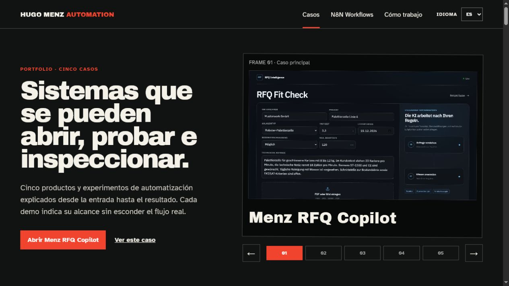

# Hugo Menz Automation Portfolio

[Portfolio ES](https://hugomenz.github.io/automation-portfolio/?lang=es) · [Portfolio EN](https://hugomenz.github.io/automation-portfolio/?lang=en) · [Portfolio DE](https://hugomenz.github.io/automation-portfolio/?lang=de)

[N8N Workflows ES](https://hugomenz.github.io/automation-portfolio/workflows/?lang=es) · [N8N Workflows EN](https://hugomenz.github.io/automation-portfolio/workflows/?lang=en) · [Arbeitsweise DE](https://hugomenz.github.io/automation-portfolio/approach/?lang=de)

[Home screenshot](docs/screenshots/desktop.png) · [workflow page screenshot](docs/screenshots/workflows-en.png)

Trilingual GitHub Pages portfolio for five inspectable automation and workflow case studies.



## Projects

1. Menz RFQ Copilot, technical-request qualification before an offer.
2. Second Brain, AI-organised notes, RAG questions, Obsidian export and a prompt-injection security lab.
3. FridgeFlow, Telegram voice input, structured inventory events, Supabase and an administration UI.
4. Agent Chaos Lab, a webhook and CRUD experiment coordinated through n8n, with Agent Observatory as its runtime view.
5. Music School Automation, course enquiries and an n8n-to-Telegram handoff, with Twilio documented only as a possible extension.

Every case explains the complete product, its five-step flow, connected platforms and one concise public-demo scope note. The home page contains the five project cases, the dedicated `/workflows/` route explains how each n8n workflow set collaborates, and `/approach/` documents the delivery method. Screenshots in `src/assets` were captured from the current local builds and n8n editor.

## Run

```bash
npm run check
npx serve src
```

Translations are maintained independently in `src/i18n/es.json`, `en.json` and `de.json`. The language selector writes `?lang=es`, `?lang=en` or `?lang=de` into every route so the selected page and language can be shared directly.

## Architecture

The portfolio is a dependency-free multipage static application. `src/app.js` loads one of the three translation JSON files and renders the home cases, workflow explanations or approach sections according to the current route. Each case uses a full-width screenshot followed by two content columns, platform logos, project-specific actions and a zoomable workflow diagram. The home slider changes its project and CTAs, the section navigator follows scroll position, and native dialogs enlarge diagrams without leaving the site. No credential or personal dataset is required at runtime.

`npm run check` verifies translation parity, five projects and workflow cases, complete project flows, platform logos, the absence of the old repeated status grid, three routes, slider, scroll navigation, native dialog, LinkedIn footer, responsive CSS, screenshot presence and common secret patterns before building `dist/` for GitHub Pages.
